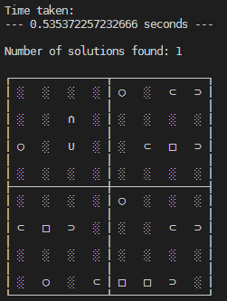

# Bimaru Solver

by Michael Schaufelberger ([@michaelschufi](https://github.com/michaelschufi)) & Gabriel Koch ([@elessar-ch](https://github.com/elessar-ch))

\
We made a Bimaru solver during an AI course at ZHAW. Using a CSP approach, it solves Bimarus in useful time. 

- Easy 8x8 puzzle - < 2s
- Hard 8x8 puzzle - < 5s
- Hard 10x10 puzzle - < 3 mins

## Usage
This repo is using [Pipenv](https://pipenv.pypa.io/en/latest/) as a package manager.

1. Run 
   ```bash
   pipenv run python bimaru.py
   ```
   to install and run the code.
1. Enjoy the solution:

   

Adjust the file `bimaru.py` as needed. You have multiple examples in the first part of the script on how to define puzzles.

## What is a Bimaru?
Bimaru is basically "Single-player Battleships" packed into a puzzle. The goal
is to place a certain amount of ships on a grid board where a few squares are
already filled out and each row and column must contain a certain amount of
ship parts.


The ships come in the following shapes:
- `○` - single
- `⊂ ⊃` - double (two ends adjacent to each other)
- `⊂ □ ⊃` - triple (two ends and a center-piece in the middle)
- `⊂ □ □ ⊃` - quadruple (two ends and two center-pieces in the middle)

Rules for ships that are true in every puzzle:
- The orientation of a ship does not matter and 
- Each part of a ship (end, center piece, or single boat) fills out a field.
- Each ship has to be surrounded by water, also diagonally.

However, each puzzle defines:
- the exact number of ship parts per row and column.
- the exact number of each ship type that have to be in the solution.

Sounds easy, right?

## Sources and Credits
The image and the free puzzles we used were taken from [bimaru.ch](https://www.bimaru.ch) and their free [Flyer PDF](https://www.bimaru.ch/wp-content/uploads/2019/04/Flyer_Bimaru-Web.pdf)
We have used the easy riddle and both "hard" ones.

We also included CSP library by Gustavo Niemeyer (see [constraint.py](constraint.py)).
